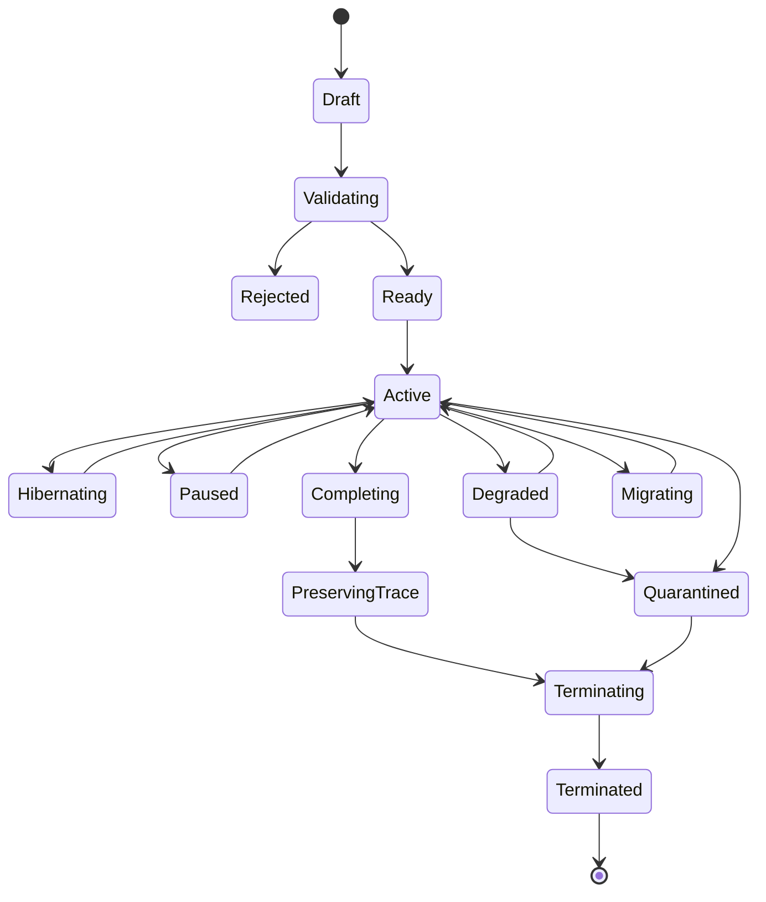
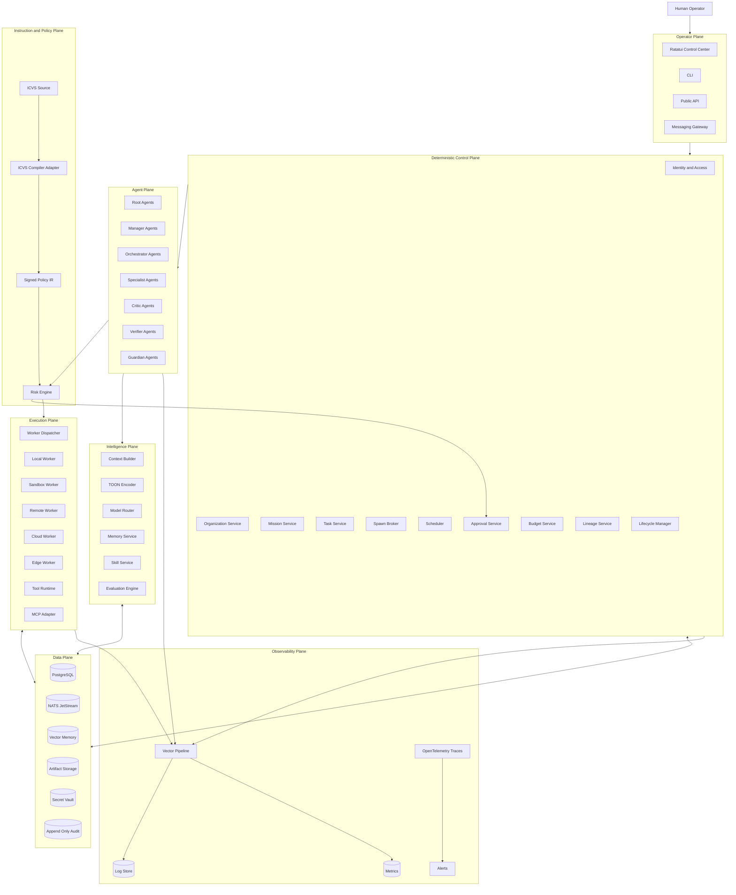
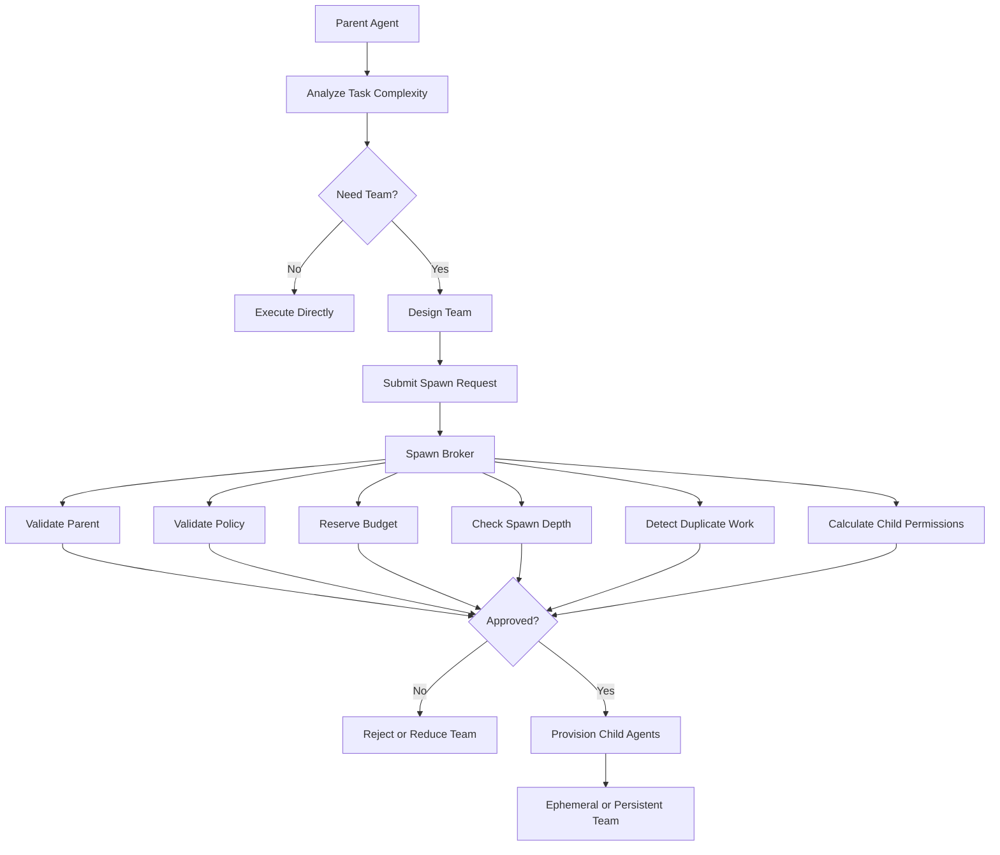
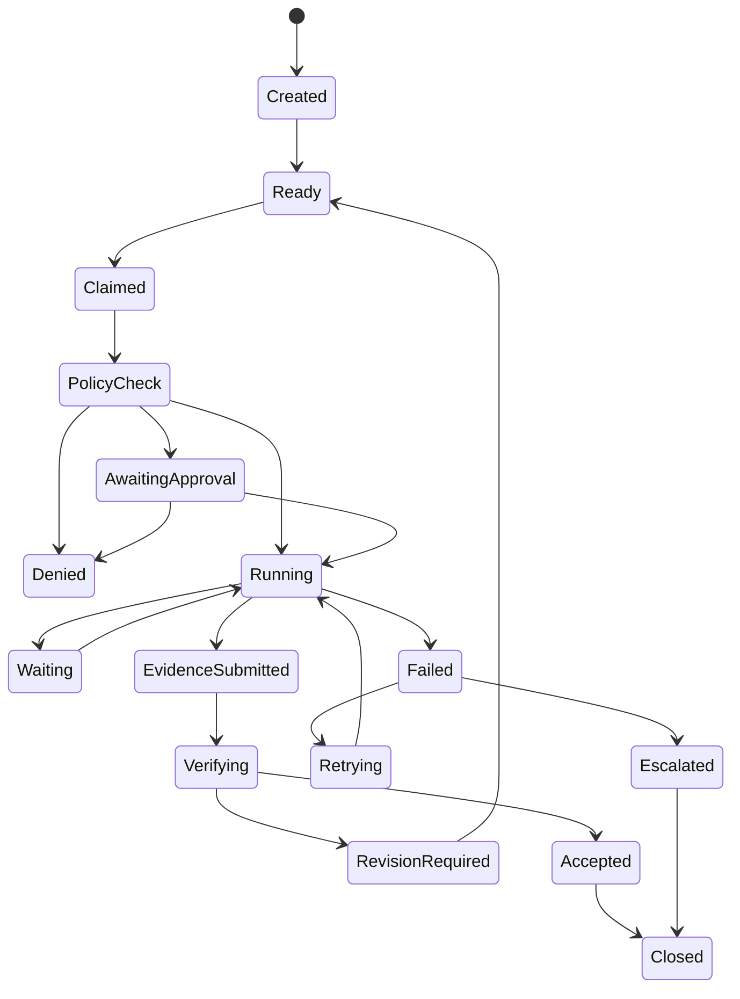
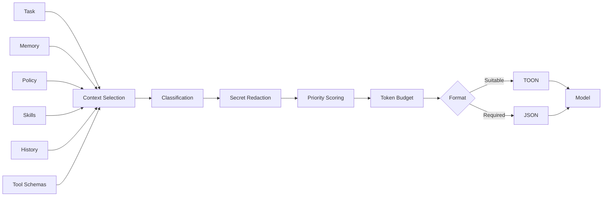
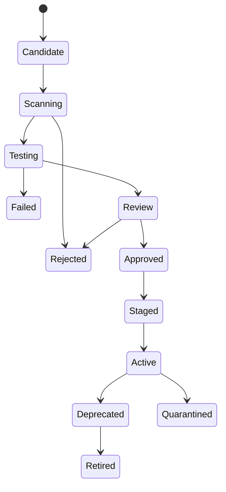
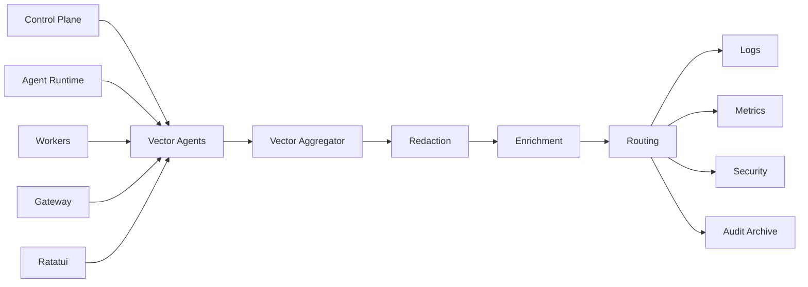

# PRODUCT REQUIREMENTS DOCUMENT

# ClawHive OS

## Recursive, Persistent, and Ephemeral Agent Swarm Operating System

**Versi dokumen:** 1.0
**Status:** Product Baseline
**Tanggal:** 27 Juni 2026
**Model pengembangan:** Build from zero
**Bahasa utama:** Rust
**Antarmuka utama:** Ratatui TUI, CLI, API, Webhook, dan Messaging Gateway
**Model deployment:** Local, private server, VPS, cloud, edge
**Nama kerja produk:** ClawHive OS

---

# 1. Ringkasan Eksekutif

ClawHive OS adalah sistem operasi untuk mengelola organisasi agen AI yang dapat:

1. menerima tujuan dari manusia;
2. menyusun rencana;
3. membentuk tim secara mandiri;
4. membuat agen anak;
5. membagi pekerjaan kepada swarm internal;
6. menjalankan tool pada komputer, server, browser, cloud, dan perangkat;
7. bekerja paralel;
8. memeriksa hasil;
9. mengendalikan biaya;
10. meminta persetujuan manusia;
11. mempelajari pola kerja yang berhasil;
12. membentuk skill baru;
13. berjalan sementara atau terus-menerus;
14. menghentikan agen dan tim secara aman;
15. mempertahankan jejak lengkap setelah agen dihentikan.

ClawHive tidak memakai sekumpulan agen statis.

Setiap agen dapat menjadi pemimpin tim. Agen dapat mengusulkan pembuatan agen anak berdasarkan kebutuhan tugas. Agen anak juga dapat membuat tim baru jika policy, anggaran, dan batas kedalaman mengizinkannya.

ClawHive mendukung dua model kehidupan utama.

## 1.1 Ephemeral Agent

Ephemeral Agent hidup untuk satu task, objective, atau mission.

Setelah pekerjaan selesai, sistem:

* membekukan agen;
* menyimpan hasil;
* menyimpan artifact;
* menyimpan lineage;
* menyimpan audit;
* mengekstrak memory yang valid;
* mencabut credential;
* menghapus workspace sementara;
* menghentikan runtime.

## 1.2 Persistent Agent

Persistent Agent mempertahankan identitas dan tanggung jawab selama:

* 24 jam;
* beberapa hari;
* beberapa bulan;
* satu periode kampanye;
* tanpa batas tanggal tertentu.

Persistent Agent tidak harus menjalankan model secara terus-menerus. Agen dapat tidur saat tidak ada pekerjaan, lalu bangun melalui:

* event;
* heartbeat;
* cron;
* webhook;
* pesan;
* perubahan kondisi;
* perintah manusia.

Identitas, tugas, checkpoint, memory, budget, dan reporting line tetap hidup meskipun proses runtime dipindahkan atau dimulai ulang.

Persistent Agent dapat membentuk:

* ephemeral swarm untuk pekerjaan sementara;
* persistent child team untuk fungsi jangka panjang;
* scheduled team untuk pekerjaan berkala;
* emergency team untuk insiden.

---

# 2. Definisi Produk

ClawHive OS adalah:

> Platform agent swarm yang memungkinkan agen membentuk tim secara rekursif, bekerja sementara atau jangka panjang, menjalankan tindakan nyata, belajar dari pengalaman, dan tetap berada di bawah kendali policy serta manusia.

ClawHive terdiri atas lima bagian utama.

| Bagian             | Fungsi                                                                        |
| ------------------ | ----------------------------------------------------------------------------- |
| Control Plane      | Mengelola identity, organization, mission, task, budget, policy, dan approval |
| Agent Plane        | Menjalankan reasoning, planning, coordination, review, dan delegation         |
| Execution Plane    | Menjalankan tool pada worker terisolasi                                       |
| Intelligence Plane | Mengelola model, context, memory, skill, dan evaluasi                         |
| Operator Plane     | Memberikan kontrol manusia melalui Ratatui, CLI, API, dan kanal komunikasi    |

---

# 3. Latar Belakang

Agen AI modern dapat membaca dokumen, menulis kode, menggunakan browser, memanggil API, mengelola komunikasi, dan menjalankan shell.

Namun, sebagian besar sistem masih memiliki masalah berikut.

## 3.1 Agen terlalu monolitik

Satu agen sering memegang terlalu banyak tool, memory, credential, dan tanggung jawab.

## 3.2 Tim agen bersifat statis

Pengembang harus menentukan seluruh agen sejak awal. Sistem tidak dapat membentuk tim baru berdasarkan kebutuhan aktual.

## 3.3 Delegasi tidak memiliki batas yang jelas

Agen dapat membuat subtugas, tetapi sistem tidak selalu membatasi:

* kedalaman spawn;
* jumlah agen;
* biaya;
* masa hidup;
* privilege;
* context inheritance.

## 3.4 Agen jangka panjang sulit dipelihara

Agen yang berjalan berbulan-bulan membutuhkan:

* checkpoint;
* restart;
* credential rotation;
* policy renewal;
* memory maintenance;
* version migration;
* handover;
* incident recovery.

## 3.5 Agen sementara meninggalkan sampah runtime

Agen dapat meninggalkan:

* process;
* container;
* temporary file;
* browser session;
* token;
* credential;
* cache.

## 3.6 Penyelesaian task tidak memiliki bukti

Agen sering menyatakan tugas selesai tanpa menunjukkan bahwa hasil benar-benar berhasil.

## 3.7 Self-improvement meningkatkan risiko

Memory atau skill yang salah dapat digunakan berulang kali dan mencemari keputusan berikutnya.

## 3.8 Biaya tidak menjadi batas operasional

Recursive swarm dapat berkembang tanpa batas jika tidak memiliki budget dan circuit breaker.

ClawHive menyelesaikan masalah tersebut melalui recursive swarm, governed spawning, dual lifecycle, deterministic policy, evidence-based completion, dan secure teardown.

---

# 4. Visi Produk

Membangun sistem tenaga kerja digital yang dapat membentuk organisasinya sendiri berdasarkan pekerjaan, tetapi tetap transparan, terbatas, terukur, dan dapat dihentikan manusia.

---

# 5. Sasaran Produk

## 5.1 Sasaran utama

1. Memungkinkan agen membuat swarm sendiri.
2. Memungkinkan child agent membuat swarm lanjutan.
3. Mendukung agen sementara dan agen jangka panjang.
4. Memisahkan logical agent dari runtime process.
5. Menjalankan setiap tindakan melalui policy engine.
6. Membatasi privilege, biaya, kedalaman, dan masa hidup.
7. Menyimpan complete agent lineage.
8. Menyimpan evidence dan artifact setiap pekerjaan.
9. Menyediakan persistent memory yang terkontrol.
10. Memungkinkan pembentukan skill yang aman.
11. Mendukung omnichannel interaction.
12. Menyediakan terminal control center.
13. Menyediakan observability terstruktur.
14. Mendukung deployment lokal hingga terdistribusi.
15. Membangun seluruh core dari nol.

## 5.2 Hasil yang diharapkan

```text
Human Goal
→ Root Agent
→ Mission Plan
→ Dynamic Team Formation
→ Recursive Child Swarms
→ Tool Execution
→ Review and Verification
→ Final Handoff
→ Memory and Skill Extraction
→ Continue, Sleep, or Secure Teardown
```

---

# 6. Non-Goals

Versi awal tidak bertujuan untuk:

1. melatih foundation model;
2. membiarkan agen mengubah policy sendiri;
3. memberi unrestricted root access;
4. memberi agen akses global ke seluruh tenant;
5. melakukan transaksi keuangan tanpa approval;
6. mengizinkan spawn tanpa batas;
7. menjalankan physical action tanpa policy;
8. memakai TOON sebagai database;
9. memakai Vector sebagai task broker;
10. memakai ICVS langsung sebagai runtime authorization engine;
11. menjamin semua pekerjaan dapat berjalan tanpa manusia;
12. menyalin source code sistem referensi;
13. membuat public skill marketplace pada MVP;
14. mempertahankan semua raw conversation selamanya;
15. menyimpan secret dalam memory atau prompt.

---

# 7. Prinsip Desain

## 7.1 Human authority

Manusia memiliki kewenangan tertinggi.

Manusia dapat:

* menghentikan agent;
* menghentikan descendant;
* membatalkan mission;
* mencabut tool;
* mengurangi budget;
* menolak approval;
* menghapus memory;
* mengarantina skill;
* mengambil alih task.

## 7.2 Agents propose, kernel decides

Agen dapat mengusulkan:

* team;
* child agent;
* tool call;
* budget allocation;
* skill;
* memory;
* policy amendment.

Kernel deterministik memutuskan apakah usulan boleh dijalankan.

## 7.3 Logical agent is not a process

Agen adalah identity dan state yang persisten.

Container, process, session, atau worker hanya menjadi runtime sementara.

Agen jangka panjang dapat berpindah worker tanpa kehilangan identitas.

## 7.4 Least privilege

Child Agent hanya menerima izin yang diperlukan.

```text
child_permissions ⊆ parent_delegable_permissions
```

## 7.5 Bounded recursion

Recursive spawning selalu dibatasi.

## 7.6 Evidence over claims

Task tidak selesai hanya karena agen mengatakan selesai.

## 7.7 Memory is untrusted until verified

Memory baru harus melalui admission pipeline.

## 7.8 Skills cannot grant privilege

Skill tidak memiliki privilege sendiri.

## 7.9 Cost is part of execution

Setiap mission, task, agent, model, dan tool memiliki batas biaya.

## 7.10 Fail closed

Kegagalan policy, identity, atau approval harus menghentikan tindakan.

## 7.11 Reversible by default

Sistem memilih draft, snapshot, transaction, versioning, dan soft delete sebelum tindakan permanen.

## 7.12 Complete lineage

Setiap agent harus memiliki root mission dan parent yang dapat dilacak.

---

# 8. Target Pengguna

## 8.1 System Owner

Mengelola deployment, provider, worker, storage, dan backup.

## 8.2 Board Operator

Menetapkan goal, budget, batas risiko, dan prioritas.

## 8.3 Human Manager

Mengawasi agent department dan approval.

## 8.4 Security Administrator

Mengelola policy, credential, sandbox, dan incident.

## 8.5 Agent Developer

Membuat template agent, tool, skill, dan evaluator.

## 8.6 Operations Operator

Mengawasi task, worker, heartbeat, dan error.

## 8.7 Auditor

Membaca lineage, keputusan, approval, dan artifact.

## 8.8 End User

Memberikan instruksi melalui terminal, API, chat, atau aplikasi lain.

---

# 9. Use Case Utama

## UC-01 Software Development Swarm

Root Agent membentuk:

* Product Analyst;
* Architect;
* Backend Team;
* Frontend Team;
* Testing Team;
* Security Team;
* Documentation Team.

Setelah milestone selesai, sebagian team dihentikan. Maintenance Agent tetap berjalan sebagai persistent agent.

## UC-02 Research Swarm

Research Lead membuat child agent untuk:

* source discovery;
* data extraction;
* citation verification;
* statistical analysis;
* report writing;
* independent review.

## UC-03 Business Operations

Persistent Operations Manager berjalan berbulan-bulan. Ia membentuk ephemeral swarm untuk setiap campaign atau incident.

## UC-04 Monitoring 24/7

Persistent Monitoring Agent:

* tidur saat tidak ada event;
* bangun saat alarm muncul;
* membuat incident swarm;
* mengoordinasikan mitigasi;
* menutup tim setelah incident selesai.

## UC-05 Sales Organization

Persistent Sales Director mengelola:

* prospect research team;
* proposal team;
* CRM team;
* communication team;
* performance review team.

## UC-06 Personal Digital Staff

Pengguna memiliki persistent Personal Chief of Staff. Agent membuat temporary team untuk perjalanan, riset, administrasi, atau proyek.

## UC-07 Edge Operations

Persistent Edge Supervisor memantau perangkat dan membentuk diagnostic swarm ketika terjadi anomali.

---

# 10. Terminologi

| Istilah          | Definisi                                                   |
| ---------------- | ---------------------------------------------------------- |
| Logical Agent    | Identity dan state agen yang tidak terikat satu process    |
| Runtime Instance | Process atau container yang menjalankan agen               |
| Root Agent       | Agen pertama dalam satu mission                            |
| Parent Agent     | Agen yang meminta pembuatan child                          |
| Child Agent      | Agen yang dibuat untuk objective tertentu                  |
| Descendant       | Semua child dan sub-child di bawah agen                    |
| Swarm Team       | Sekumpulan agen yang mengerjakan satu objective            |
| Spawn            | Proses membuat logical agent baru                          |
| Fork             | Membuat child dari Agent Genome dengan context terpilih    |
| Spawn Broker     | Service yang memvalidasi dan membuat agent                 |
| Agent Genome     | Template pembentukan agent                                 |
| Ephemeral Agent  | Agent yang berakhir bersama task atau objective            |
| Persistent Agent | Agent yang mempertahankan identity lintas task dan restart |
| Legacy Trace     | Jejak final agen setelah termination                       |
| Lineage          | Hubungan root, parent, child, dan descendant               |
| Heartbeat        | Sinyal periodik status logical agent atau worker           |
| Checkpoint       | State yang dapat dipakai untuk resume                      |
| Hibernation      | Persistent agent tidur tanpa runtime aktif                 |
| Secure Teardown  | Proses penutupan runtime dan pencabutan akses              |
| Mission          | Tujuan tingkat tinggi                                      |
| Task             | Unit pekerjaan yang dapat diverifikasi                     |
| Artifact         | Hasil file atau objek pekerjaan                            |
| Evidence         | Bukti bahwa acceptance criteria terpenuhi                  |
| Skill            | Prosedur reusable yang telah diuji                         |
| Policy IR        | Representasi kebijakan internal yang deterministik         |

---

# 11. Model Kehidupan Agen

## 11.1 Ephemeral Mode

Ephemeral Agent memiliki:

* satu objective;
* task binding;
* TTL;
* budget;
* maximum turn;
* termination rule;
* limited memory scope.

Agent berakhir setelah:

* task diterima verifier;
* objective dibatalkan;
* TTL habis;
* budget habis;
* parent dihentikan;
* operator menghentikan agent;
* policy violation;
* agent menjadi duplikat.

## 11.2 Persistent Mode

Persistent Agent mempertahankan:

* identity;
* role;
* reporting line;
* mission ownership;
* memory namespace;
* reputation;
* policy profile;
* budget cycle;
* checkpoint;
* schedule;
* subscriptions.

Persistent Agent mendukung tiga pola.

### Always On

Agent tersedia 24/7 dan menerima event kapan saja.

### Scheduled

Agent bangun berdasarkan jadwal.

### Campaign

Agent hidup hingga tanggal atau objective jangka panjang tercapai.

## 11.3 Hibernating Persistent Agent

Persistent Agent dapat tidur tanpa process aktif.

Saat hibernasi:

* identity tetap aktif;
* event subscription tetap terdaftar;
* memory tetap tersedia;
* runtime lease dilepas;
* model tidak dipanggil;
* biaya compute berhenti;
* scheduler dapat membangunkan agent.

## 11.4 Hybrid Team

Persistent Parent dapat membuat ephemeral children untuk tugas harian.

```text
Persistent Operations Manager
├── Ephemeral Incident Team
├── Ephemeral Reporting Team
├── Persistent Monitoring Agent
└── Scheduled Audit Agent
```

---

# 12. Agent Lifecycle State



## 12.1 Migrating

Persistent Agent dapat berpindah dari satu worker ke worker lain.

Proses migrasi:

1. freeze task claim;
2. buat checkpoint;
3. tutup runtime lama;
4. pindahkan state;
5. validasi policy;
6. buat runtime baru;
7. resume subscription;
8. lanjutkan task.

---

# 13. Arsitektur Tingkat Tinggi



---

# 14. Organization Model

Satu tenant dapat memiliki beberapa organization.

Organization memiliki:

* mission statement;
* departments;
* roles;
* reporting lines;
* human members;
* agent members;
* budgets;
* policies;
* tools;
* data boundaries.

Contoh:

```text
Organization
├── Board
├── Executive Department
│   └── Persistent Director Agent
├── Engineering Department
│   ├── Persistent Engineering Manager
│   └── Ephemeral Project Teams
├── Research Department
├── Security Department
├── Operations Department
└── Audit Department
```

Human dan agent dapat berada dalam struktur yang sama.

---

# 15. Agent Types

## 15.1 Root Agent

Menerima goal manusia dan memulai mission.

## 15.2 Director Agent

Mengatur beberapa workstream dan persistent department.

## 15.3 Planner Agent

Membentuk task graph dan kebutuhan team.

## 15.4 Orchestrator Agent

Dapat membuat child agents dan mengoordinasikan swarm.

## 15.5 Specialist Agent

Menjalankan keahlian tertentu.

## 15.6 Critic Agent

Mencari kelemahan pada output.

## 15.7 Verifier Agent

Memeriksa acceptance criteria dan evidence.

## 15.8 Judge Agent

Membandingkan beberapa solusi.

## 15.9 Security Guardian

Memberikan risk analysis dan anomaly signal.

## 15.10 Memory Curator

Menilai kandidat memory.

## 15.11 Skill Engineer

Membentuk candidate skill.

## 15.12 Cost Controller

Memantau cost velocity dan loop.

## 15.13 Recovery Agent

Menangani task atau runtime yang gagal.

## 15.14 Watcher Agent

Persistent agent yang memantau kondisi tertentu.

## 15.15 Maintenance Agent

Menangani pekerjaan berkala, health check, dan cleanup.

---

# 16. Agent Genome

Agent Genome adalah template pembentukan agent.

```yaml
api_version: clawhive/v1
kind: AgentGenome

metadata:
  id: software-security-reviewer
  version: 1.0.0

spec:
  role: security_reviewer
  lifecycle_modes:
    - ephemeral
    - persistent

  model_policy:
    preferred_profile: reasoning-medium
    fallback_profiles:
      - reasoning-small
    max_context_tokens: 64000

  autonomy:
    can_spawn: true
    max_spawn_depth: 1
    max_children: 3

  delegable_permissions:
    - repository.read
    - test.run
    - static_analysis.run

  non_delegable_permissions:
    - production.write
    - secret.read

  memory:
    default_read_scopes:
      - organization/security
    default_write_scope:
      - mission/security-findings

  runtime:
    preferred_class: sandbox
    network: deny_by_default

  verification:
    required: true
```

Child Agent tidak menjadi salinan penuh parent.

Child Agent hanya mewarisi:

* objective;
* required context;
* constraints;
* selected memory;
* delegable permissions;
* budget allocation;
* policy bundle;
* output contract.

---

# 17. Recursive Swarm Formation

## 17.1 Flow



## 17.2 Spawn Request

```yaml
api_version: clawhive/v1
kind: SpawnRequest

metadata:
  id: spawn-204-01
  mission_id: mission-204
  task_id: task-14
  requested_by: engineering-manager-01

spec:
  reason: Backend review requires independent database and API specialists

  team:
    name: backend-review-team
    lifecycle_mode: ephemeral
    ttl_seconds: 7200
    idle_timeout_seconds: 600

  children:
    - role: database_specialist
      objective: Review transaction safety
      budget_usd: 1.00
      model_profile: reasoning-medium
      max_turns: 20

    - role: api_test_specialist
      objective: Test update endpoints
      budget_usd: 1.50
      model_profile: coding-medium
      max_turns: 25

  child_spawn_policy:
    allowed: false

  termination:
    on_task_complete: true
    on_parent_terminated: true
    on_budget_exhausted: true
```

## 17.3 Spawn Constraints

```text
spawn_allowed =
    parent_is_active
    AND parent_has_spawn_permission
    AND task_is_active
    AND objective_is_bounded
    AND budget_is_available
    AND depth_is_valid
    AND swarm_size_is_valid
    AND permissions_are_delegable
    AND no_duplicate_agent_exists
    AND policy_allows
```

## 17.4 Default Limits

```yaml
swarm_limits:
  max_spawn_depth: 3
  max_children_per_agent: 5
  max_agents_per_mission: 30
  max_concurrent_agents: 12
  max_persistent_children_per_agent: 3
  max_turns_per_ephemeral_agent: 40
  max_idle_seconds_ephemeral: 600
```

Enterprise deployment dapat mengubah limit melalui policy.

---

# 18. Persistent Swarm Requirements

## 18.1 Identity Persistence

Persistent Agent memiliki identity yang tidak berubah meskipun:

* process mati;
* container restart;
* worker diganti;
* model provider berubah;
* application di-upgrade.

## 18.2 Runtime Lease

Persistent Agent menggunakan runtime lease.

```yaml
runtime_lease:
  agent_id: monitoring-agent-01
  worker_id: worker-07
  acquired_at: 2026-06-27T10:00:00Z
  expires_at: 2026-06-27T10:05:00Z
  renewal_interval_seconds: 60
```

## 18.3 Checkpoint

Checkpoint dibuat:

* setelah state transition;
* setelah tool side effect;
* sebelum hibernation;
* sebelum migration;
* sebelum upgrade;
* secara periodik.

## 18.4 Session Rotation

Long-running agent tidak memakai satu conversation tanpa batas.

Sistem melakukan session rotation berdasarkan:

* token count;
* elapsed time;
* completed work unit;
* context quality;
* policy change;
* model change.

Sebelum rotasi, sistem membuat:

* structured summary;
* open task list;
* unresolved risks;
* memory candidates;
* lineage checkpoint;
* budget snapshot.

## 18.5 Policy Renewal

Persistent Agent wajib mengevaluasi ulang policy saat:

* policy bundle berubah;
* role berubah;
* mission berubah;
* tool berubah;
* credential berubah;
* data classification berubah.

## 18.6 Credential Rotation

Credential persistent agent harus:

* berumur pendek;
* dapat diperbarui;
* memiliki scope;
* dapat dicabut;
* tidak tersimpan dalam memory.

## 18.7 Maintenance Window

Persistent Agent dapat memiliki maintenance window untuk:

* upgrade;
* memory compaction;
* skill validation;
* policy migration;
* database maintenance;
* runtime replacement.

## 18.8 Persistent Descendants

Persistent Child Agent harus memiliki:

* owner;
* continuing responsibility;
* periodic review;
* recurring budget;
* review date;
* shutdown criteria.

Tidak boleh ada persistent child tanpa tanggung jawab aktif.

---

# 19. Mission Model

Mission memiliki:

* objective;
* owner;
* scope;
* constraints;
* lifecycle;
* budget;
* risk;
* deadline;
* required evidence;
* success criteria;
* termination criteria.

```yaml
api_version: clawhive/v1
kind: Mission

metadata:
  id: mission-204
  organization_id: org-a

spec:
  objective: Maintain and improve the Teacher Portal

  lifecycle:
    mode: persistent
    campaign_end: null
    review_interval_days: 30

  budget:
    monthly_usd: 100
    hard_limit_usd: 120

  risk:
    default: medium

  acceptance:
    require_evidence: true
    minimum_verifiers: 1

  termination:
    manual: true
    inactivity_days: 90
```

---

# 20. Task Model

Setiap task memiliki:

* task ID;
* mission ID;
* parent task;
* objective;
* owner;
* dependencies;
* risk;
* budget;
* deadline;
* input;
* output contract;
* evidence contract;
* retry policy;
* idempotency key;
* lifecycle mode.

## 20.1 Task States



---

# 21. Scheduler

Scheduler bersifat deterministik.

Scheduler menangani:

* dependency;
* task lease;
* priority;
* agent capacity;
* model capacity;
* worker placement;
* budget reservation;
* deadline;
* retries;
* persistent schedules;
* hibernation;
* wake-up event.

## 21.1 Agent Assignment Score

```text
assignment_score =
    capability_match
    + role_match
    + reputation
    + data_locality
    + worker_availability
    + continuity_score
    - estimated_cost
    - active_load
    - risk_penalty
```

LLM dapat merekomendasikan assignment, tetapi scheduler membuat keputusan final.

---

# 22. Heartbeat and Event Model

## 22.1 Logical Agent Heartbeat

Menunjukkan:

* agent state;
* active task;
* child count;
* budget remaining;
* last checkpoint;
* policy version;
* runtime lease;
* health.

## 22.2 Worker Heartbeat

Menunjukkan:

* CPU;
* memory;
* active runtime;
* queue;
* tool availability;
* sandbox health;
* version.

## 22.3 Event-Driven Wake

Persistent Agent dapat berlangganan:

* webhook;
* queue event;
* database event;
* calendar schedule;
* filesystem event;
* monitoring alarm;
* user message;
* child completion;
* approval decision.

---

# 23. Context Engineering and TOON

## 23.1 Canonical Data

Internal canonical formats:

* Rust structs;
* PostgreSQL rows;
* JSON;
* Protobuf.

TOON tidak menjadi canonical storage format.

## 23.2 TOON Usage

TOON digunakan untuk:

* task context;
* agent roster;
* child context;
* memory digest;
* evidence summary;
* policy summary;
* structured tool result;
* cost summary.

## 23.3 Context Pipeline



## 23.4 TOON Fallback

Jika model gagal:

1. lakukan satu repair attempt;
2. fallback ke JSON;
3. catat failure;
4. perbarui suitability score.

---

# 24. ICVS Instruction and Policy Layer

## 24.1 Position

ICVS menjadi source authoring format.

ClawHive tidak mengeksekusi raw ICVS secara langsung.

```text
ICVS Source
→ Strict Parse
→ Cycle Detection
→ Reference Resolution
→ Conflict Detection
→ Internal Policy IR
→ Signature
→ Activation
```

## 24.2 Policy Subjects

Policy dapat berlaku untuk:

* tenant;
* organization;
* department;
* role;
* agent;
* mission;
* task;
* tool;
* worker;
* data class.

## 24.3 Policy Precedence

```text
System explicit deny
Tenant explicit deny
Organization explicit deny
Mission explicit deny
Task explicit deny
System allow
Tenant allow
Organization allow
Mission allow
Task allow
```

Explicit deny selalu menang.

## 24.4 Example ICVS

```ini
#project: "clawhive-security"

[node: require_agent_identity]
  type = rule
  severity = must
  content = "Every action requires tenant, mission, task, and agent identity"

[node: restrict_child_permissions]
  type = rule
  severity = must
  content = "Child permissions cannot exceed parent delegable permissions"

[node: external_send_approval]
  type = condition
  if = $ACTION == "communication.send_external"
    then = -> require_human_approval
    else = -> continue_evaluation

[node: require_human_approval]
  type = action
  content = "Create scoped approval request"

[node: continue_evaluation]
  type = action
  content = "Continue deterministic evaluation"

[edge: require_agent_identity -> restrict_child_permissions]
[edge: restrict_child_permissions -> external_send_approval]

[target: clawhive]
  resolve = [
    require_agent_identity,
    restrict_child_permissions,
    external_send_approval
  ]
```

---

# 25. Identity and Access Management

Setiap entity memiliki identity:

* human;
* agent;
* service;
* worker;
* tool;
* organization.

Authorization menggunakan:

* RBAC;
* ABAC;
* task scope;
* resource scope;
* time scope;
* risk context;
* data classification.

Child Agent tidak menerima parent credential.

Spawn Broker membuat identity baru dengan:

* unique ID;
* parent reference;
* mission reference;
* permission set;
* TTL;
* secret lease policy.

---

# 26. Human Approval

## 26.1 Approval Levels

| Level | Ketentuan                       |
| ----- | ------------------------------- |
| L0    | Otomatis                        |
| L1    | Deterministic policy approval   |
| L2    | Satu human approver             |
| L3    | Security or compliance approval |
| L4    | Dual human approval             |
| L5    | Dilarang                        |

## 26.2 Default Approval Actions

* external communication;
* production deployment;
* production data mutation;
* deletion;
* secret access;
* permission increase;
* policy activation;
* persistent agent creation;
* physical action;
* financial transaction.

## 26.3 Persistent Agent Approval

Pembuatan persistent agent baru membutuhkan approval jika:

* memiliki akses eksternal;
* memiliki recurring budget;
* berjalan lebih lama dari batas policy;
* dapat membuat persistent children;
* dapat menjalankan side effect.

---

# 27. Memory System

## 27.1 Memory Types

* working memory;
* episodic memory;
* semantic memory;
* procedural memory;
* user memory;
* organization memory;
* mission memory;
* agent continuity memory.

## 27.2 Memory Record

```yaml
id: memory-778
tenant_id: tenant-a
scope: mission/teacher-portal
type: semantic

content: Question update must use a transaction

source:
  agent_id: database-specialist-01
  task_id: task-14
  evidence_id: evidence-205

confidence: 0.94
classification: confidential
status: active
verified_by:
  - verifier-01
```

## 27.3 Admission Pipeline

```text
Candidate
→ Classification
→ Injection Scan
→ Deduplication
→ Source Check
→ Confidence Score
→ Scope Assignment
→ Verification
→ Activation
```

## 27.4 Persistent Memory Maintenance

Long-running agents require:

* periodic compaction;
* conflict detection;
* expiration;
* stale fact review;
* unused memory cleanup;
* source revalidation.

---

# 28. Skills System

A skill terdiri atas:

* purpose;
* input schema;
* output schema;
* steps;
* required tools;
* required permissions;
* test suite;
* safety rules;
* cost profile;
* version;
* signature.

## 28.1 Skill Lifecycle



Agen dapat membuat candidate skill. Agen tidak boleh mengaktifkannya sendiri.

---

# 29. Tool System

## 29.1 Tool Categories

* filesystem;
* shell;
* browser;
* HTTP;
* database;
* source control;
* communication;
* document;
* spreadsheet;
* media;
* cloud;
* infrastructure;
* hardware;
* MCP;
* custom API.

## 29.2 Side Effect Classes

| Class                  | Contoh                   |
| ---------------------- | ------------------------ |
| Read Only              | Membaca file             |
| Reversible Write       | Membuat draft            |
| Controlled Write       | Membuat branch           |
| External Communication | Mengirim pesan           |
| Production Mutation    | Mengubah sistem produksi |
| Destructive            | Menghapus data           |
| Physical               | Mengontrol perangkat     |

## 29.3 Tool Invocation

Setiap invocation harus membawa:

* tenant ID;
* mission ID;
* task ID;
* agent ID;
* worker ID;
* policy bundle;
* idempotency key;
* risk level;
* approval ID jika diperlukan.

---

# 30. Execution Fabric

## 30.1 Worker Types

* local;
* sandbox;
* remote;
* cloud;
* edge;
* device.

## 30.2 Default Isolation

* non-root;
* read-only base;
* temporary workspace;
* process limit;
* CPU limit;
* memory limit;
* execution timeout;
* network deny by default;
* egress allowlist;
* scoped secret lease.

## 30.3 Persistent Agent Runtime

Persistent identity tidak berarti persistent process.

Runtime dapat:

* dimulai saat event;
* dihentikan saat idle;
* dipindahkan;
* diperbarui;
* direplikasi secara terkendali.

Hanya satu active writer runtime yang boleh mengendalikan satu logical agent, kecuali policy mendukung coordinated replicas.

---

# 31. Omnichannel Gateway

ClawHive mendukung adapter untuk:

* terminal;
* REST;
* webhook;
* email;
* Telegram;
* WhatsApp;
* Slack;
* Discord;
* mobile application;
* internal event bus.

Setiap inbound message harus melewati:

1. sender authentication;
2. tenant resolution;
3. channel policy;
4. session routing;
5. attachment scan;
6. rate limit;
7. prompt injection classification.

---

# 32. Secure Teardown

## 32.1 Teardown Stages

### Freeze

Agent tidak menerima task atau tool baru.

### Handoff

Agent menyerahkan hasil dan unresolved issue.

### Verify

Verifier memeriksa output.

### Preserve

Sistem menyimpan legacy trace.

### Revoke

Sistem mencabut token, lease, credential, dan session.

### Destroy

Sistem menghapus process, container, workspace, cache, dan browser session.

### Seal

Sistem menutup lineage record dan audit hash.

## 32.2 Descendant Teardown

Jika parent dihentikan:

* descendant dibekukan;
* task dialihkan atau dibatalkan;
* final handoff diminta;
* credential dicabut;
* runtime dihentikan;
* forced legacy record dibuat.

Policy dapat mempertahankan descendant tertentu dengan melakukan reparenting yang disetujui.

---

# 33. Agent Legacy Trace

Setiap agent yang berakhir menghasilkan record.

```yaml
api_version: clawhive/v1
kind: AgentLegacy

metadata:
  agent_id: agent-7F21
  parent_agent_id: engineering-lead-01
  lineage_id: lineage-204
  mission_id: mission-204

lifecycle:
  mode: ephemeral
  created_at: 2026-06-27T14:00:00Z
  terminated_at: 2026-06-27T14:14:31Z
  termination_reason: task_completed

execution:
  model_calls: 7
  tool_calls: 4
  children_created: 0
  cost_usd: 0.42

result:
  status: accepted
  artifact_ids:
    - artifact-101
  evidence_ids:
    - evidence-205

memory:
  proposed:
    - memory-candidate-09
  accepted:
    - memory-778

security:
  policy_denials: 0
  anomalies: []

integrity:
  trace_hash: sha256:abc123
  signed_by: control-plane
```

Persistent Agent juga menghasilkan periodic legacy snapshots.

---

# 34. Evidence and Verification

## 34.1 Evidence Types

* file;
* screenshot;
* test output;
* command result;
* API result;
* database diff;
* deployment health;
* source citation;
* human confirmation.

## 34.2 Completion Rule

```text
task_complete =
    output_contract_satisfied
    AND required_evidence_present
    AND verifier_accepts
    AND policy_compliant
    AND cost_recorded
    AND audit_persisted
```

---

# 35. Ratatui Control Center

Ratatui menjadi operator interface utama.

## 35.1 Screens

* Overview;
* Organizations;
* Missions;
* Tasks;
* Agents;
* Swarms;
* Agent Lineage;
* Persistent Agents;
* Spawn Requests;
* Approvals;
* Workers;
* Policies;
* Memory;
* Skills;
* Artifacts;
* Costs;
* Logs;
* Incidents;
* Terminated Agent Archive.

## 35.2 Persistent Agent Screen

Menampilkan:

* lifecycle mode;
* uptime;
* current runtime;
* hibernation state;
* subscriptions;
* schedules;
* checkpoint;
* monthly cost;
* child teams;
* next review;
* policy version.

## 35.3 Example

```text
┌ ClawHive Control Center ───────────────────────────────────────────────┐
│ Organization: Teacher Portal                  Environment: Production │
├───────────────────┬───────────────────────────────────────────────────┤
│ PERSISTENT AGENTS │ ACTIVE SWARM                                      │
│                   │                                                   │
│ ● Director        │ Mission: Security Audit                           │
│ ● Ops Manager     │ Root: security-manager-01                         │
│ ○ Report Agent    │ Children: 6 active, 2 completed                   │
│ ● Monitor Agent   │ Depth: 2 / 3                                      │
│                   │ Budget: $7.20 / $15.00                            │
├───────────────────┼───────────────────────────────────────────────────┤
│ SPAWN REQUESTS    │ EXECUTION                                         │
│ SR-014 APPROVAL   │ Agent: database-specialist-03                     │
│ SR-015 VALIDATING │ Worker: sandbox-worker-07                         │
│ SR-016 DENIED     │ Tool: static_analysis.run                         │
├───────────────────┴───────────────────────────────────────────────────┤
│ [a] approve  [d] deny  [p] pause  [k] kill  [g] lineage  [l] logs     │
└───────────────────────────────────────────────────────────────────────┘
```

## 35.4 TUI Architecture

Gunakan pola:

```text
Event
→ Message
→ State Update
→ Command
→ Render
```

TUI tidak berkomunikasi langsung dengan worker. Semua command melewati Control API.

---

# 36. Vector Observability

Vector digunakan untuk:

* logs;
* structured agent events;
* metrics;
* security events;
* audit copies;
* worker telemetry.

OpenTelemetry digunakan untuk distributed tracing.

## 36.1 Topology



## 36.2 Required Fields

```json
{
  "timestamp": "2026-06-27T15:02:18Z",
  "tenant_id": "tenant-a",
  "mission_id": "mission-204",
  "task_id": "task-14",
  "agent_id": "agent-7F21",
  "parent_agent_id": "engineering-lead-01",
  "lineage_id": "lineage-204",
  "worker_id": "worker-07",
  "trace_id": "trace-001",
  "event_type": "agent.terminated",
  "lifecycle_mode": "ephemeral",
  "risk_level": "medium",
  "status": "success",
  "cost_usd": 0.42
}
```

Vector harus menghapus:

* passwords;
* tokens;
* cookies;
* API keys;
* authorization headers;
* private keys;
* sensitive tool arguments.

---

# 37. Data Architecture

## 37.1 PostgreSQL

Menyimpan:

* tenant;
* organization;
* identity;
* agent;
* lineage;
* mission;
* task;
* lease;
* spawn request;
* approval;
* policy;
* budget;
* memory metadata;
* skill metadata;
* artifact metadata;
* legacy metadata.

## 37.2 NATS JetStream

Digunakan untuk:

* task dispatch;
* commands;
* state events;
* heartbeat;
* wake events;
* child completion;
* approval result.

## 37.3 Vector Database

Digunakan untuk semantic memory retrieval.

## 37.4 Object Storage

Digunakan untuk:

* artifact;
* screenshot;
* reports;
* dataset;
* test output;
* legacy bundles.

## 37.5 Secret Vault

Menyimpan credential dan secret leases.

## 37.6 Append-Only Audit

Menyimpan critical audit events.

---

# 38. Core Domain Entities

```text
Tenant
Organization
Department
HumanIdentity
ServiceIdentity
AgentIdentity
AgentGenome
AgentRuntime
AgentCheckpoint
AgentSubscription
AgentSchedule
AgentLineage
AgentLegacy
SpawnRequest
Mission
Task
TaskDependency
TaskLease
Approval
PolicyBundle
PolicyRule
Tool
ToolInvocation
Worker
WorkerCapability
ModelProvider
ModelProfile
Memory
Skill
SkillVersion
Artifact
Evidence
Budget
CostRecord
Reputation
Incident
AuditEvent
Channel
Session
```

---

# 39. API Requirements

## 39.1 Primary Endpoints

```text
POST   /v1/missions
GET    /v1/missions/{id}
POST   /v1/missions/{id}/pause
POST   /v1/missions/{id}/resume
POST   /v1/missions/{id}/cancel

POST   /v1/tasks
GET    /v1/tasks/{id}
POST   /v1/tasks/{id}/retry
POST   /v1/tasks/{id}/submit-evidence

POST   /v1/agents
GET    /v1/agents/{id}
POST   /v1/agents/{id}/pause
POST   /v1/agents/{id}/hibernate
POST   /v1/agents/{id}/wake
POST   /v1/agents/{id}/terminate
POST   /v1/agents/{id}/migrate

POST   /v1/spawn-requests
GET    /v1/spawn-requests/{id}
POST   /v1/spawn-requests/{id}/approve
POST   /v1/spawn-requests/{id}/deny

GET    /v1/lineages/{id}
GET    /v1/agents/{id}/legacy

POST   /v1/policies/compile
POST   /v1/policies/simulate
POST   /v1/policies/activate

GET    /v1/approvals
POST   /v1/approvals/{id}/approve
POST   /v1/approvals/{id}/deny

GET    /v1/workers
POST   /v1/workers/{id}/drain

GET    /v1/costs
GET    /v1/audit/events
```

---

# 40. Functional Requirements

## 40.1 Organization

| ID     | Requirement                                                         |
| ------ | ------------------------------------------------------------------- |
| FR-001 | Sistem harus mendukung tenant dan organization.                     |
| FR-002 | Organization harus memiliki departments, roles, goals, dan budgets. |
| FR-003 | Human dan agent dapat berada dalam organization yang sama.          |
| FR-004 | Semua reporting line harus dapat dilacak.                           |

## 40.2 Agent Lifecycle

| ID     | Requirement                                                   |
| ------ | ------------------------------------------------------------- |
| FR-010 | Agent harus mendukung ephemeral dan persistent mode.          |
| FR-011 | Persistent identity tidak boleh bergantung pada satu process. |
| FR-012 | Persistent Agent harus mendukung hibernation.                 |
| FR-013 | Persistent Agent harus mendukung checkpoint dan resume.       |
| FR-014 | Agent harus dapat dimigrasikan ke worker lain.                |
| FR-015 | Agent harus memiliki termination rule.                        |
| FR-016 | Terminated Agent harus menghasilkan legacy trace.             |

## 40.3 Recursive Spawn

| ID     | Requirement                                                        |
| ------ | ------------------------------------------------------------------ |
| FR-020 | Agent harus dapat mengusulkan child agent.                         |
| FR-021 | Spawn hanya dapat dilakukan Spawn Broker.                          |
| FR-022 | Child permission tidak boleh melebihi delegable permission parent. |
| FR-023 | Child budget harus berasal dari budget parent atau mission.        |
| FR-024 | Sistem harus membatasi spawn depth.                                |
| FR-025 | Sistem harus membatasi children per agent.                         |
| FR-026 | Sistem harus mendeteksi duplicate objective.                       |
| FR-027 | Sistem harus mendeteksi recursive spawn loop.                      |
| FR-028 | Child Agent harus memiliki parent dan lineage.                     |
| FR-029 | Child Agent dapat ephemeral atau persistent.                       |

## 40.4 Long-Running Agents

| ID     | Requirement                                                                    |
| ------ | ------------------------------------------------------------------------------ |
| FR-030 | Persistent Agent harus dapat berjalan berbulan-bulan.                          |
| FR-031 | Persistent Agent harus mendukung recurring budget.                             |
| FR-032 | Persistent Agent harus mendukung schedule dan subscriptions.                   |
| FR-033 | Persistent Agent harus melakukan policy renewal.                               |
| FR-034 | Persistent Agent harus melakukan credential rotation.                          |
| FR-035 | Persistent Agent harus mendukung session rotation.                             |
| FR-036 | Persistent Agent harus memiliki periodic review.                               |
| FR-037 | Persistent Agent tanpa tanggung jawab aktif harus dihibernasi atau dihentikan. |

## 40.5 Missions and Tasks

| ID     | Requirement                                                |
| ------ | ---------------------------------------------------------- |
| FR-040 | Mission harus memiliki objective, scope, budget, dan risk. |
| FR-041 | Task harus memiliki output contract.                       |
| FR-042 | Task harus memiliki acceptance criteria.                   |
| FR-043 | Task claim harus atomik.                                   |
| FR-044 | Side effect harus memiliki idempotency key.                |
| FR-045 | Task tidak boleh selesai tanpa required evidence.          |

## 40.6 Governance

| ID     | Requirement                                            |
| ------ | ------------------------------------------------------ |
| FR-050 | Semua tool calls harus melewati policy engine.         |
| FR-051 | Policy harus dikompilasi ke Internal Policy IR.        |
| FR-052 | Explicit deny harus mengalahkan allow.                 |
| FR-053 | Persistent Agent creation dapat diwajibkan approval.   |
| FR-054 | Permission increase harus membutuhkan approval.        |
| FR-055 | Operator harus dapat menghentikan seluruh descendants. |

## 40.7 Memory and Skills

| ID     | Requirement                                              |
| ------ | -------------------------------------------------------- |
| FR-060 | Memory harus memiliki source, scope, dan confidence.     |
| FR-061 | Memory baru harus melewati admission pipeline.           |
| FR-062 | Child memory tidak langsung menjadi organization memory. |
| FR-063 | Agen dapat membuat candidate skill.                      |
| FR-064 | Skill harus diuji dan ditandatangani.                    |
| FR-065 | Skill tidak boleh menambah privilege.                    |

## 40.8 Execution

| ID     | Requirement                                                            |
| ------ | ---------------------------------------------------------------------- |
| FR-070 | Sistem harus mendukung local, sandbox, remote, cloud, dan edge worker. |
| FR-071 | Worker harus memiliki identity dan heartbeat.                          |
| FR-072 | Network harus deny by default.                                         |
| FR-073 | Runtime harus menggunakan scoped credential.                           |
| FR-074 | Operator harus dapat menghentikan tool execution.                      |
| FR-075 | Runtime cleanup harus idempotent.                                      |

## 40.9 Operator Interface

| ID     | Requirement                                                |
| ------ | ---------------------------------------------------------- |
| FR-080 | Ratatui harus menampilkan agent, task, swarm, dan lineage. |
| FR-081 | Ratatui harus menampilkan persistent agent state.          |
| FR-082 | Ratatui harus menampilkan spawn requests.                  |
| FR-083 | Ratatui harus mendukung approval dan termination.          |
| FR-084 | Ratatui tidak boleh menampilkan secret.                    |
| FR-085 | Ratatui harus berfungsi melalui SSH.                       |

## 40.10 Observability

| ID     | Requirement                                                   |
| ------ | ------------------------------------------------------------- |
| FR-090 | Semua service harus menghasilkan structured events.           |
| FR-091 | Vector harus melakukan redaction.                             |
| FR-092 | Events harus memiliki lineage ID dan trace ID.                |
| FR-093 | Telemetry failure tidak boleh mengubah task state.            |
| FR-094 | Operator harus dapat mencari event berdasarkan agent lineage. |

---

# 41. Non-Functional Requirements

## 41.1 Security

| ID      | Requirement                                            |
| ------- | ------------------------------------------------------ |
| NFR-001 | Semua service communication harus terenkripsi.         |
| NFR-002 | Remote worker harus menggunakan mutual authentication. |
| NFR-003 | Secrets tidak boleh masuk prompt, log, atau memory.    |
| NFR-004 | Policy failure harus fail closed.                      |
| NFR-005 | Sandbox harus memakai non-root execution.              |
| NFR-006 | Tenant isolation harus diuji.                          |

## 41.2 Reliability

| ID      | Requirement                                                 |
| ------- | ----------------------------------------------------------- |
| NFR-010 | Logical Agent state harus bertahan setelah runtime restart. |
| NFR-011 | Persistent Agent harus dapat resume dari checkpoint.        |
| NFR-012 | Event consumer harus idempotent.                            |
| NFR-013 | Spawn dan termination harus idempotent.                     |
| NFR-014 | Worker failure tidak boleh menghapus lineage.               |
| NFR-015 | Backup restore harus diuji.                                 |

## 41.3 Performance

| ID      | Requirement                                    |
| ------- | ---------------------------------------------- |
| NFR-020 | Cached policy evaluation p95 di bawah 100 ms.  |
| NFR-021 | Spawn decision p95 di bawah 500 ms.            |
| NFR-022 | Local child provisioning p95 di bawah 3 detik. |
| NFR-023 | TUI live update p95 di bawah 3 detik.          |
| NFR-024 | Kill propagation p95 di bawah 5 detik.         |

## 41.4 Scalability

| ID      | Requirement                                         |
| ------- | --------------------------------------------------- |
| NFR-030 | MVP mendukung 20 active agents.                     |
| NFR-031 | V1 mendukung 200 registered agents.                 |
| NFR-032 | V1 mendukung 50 persistent agents per organization. |
| NFR-033 | Distributed mode mendukung 1.000 concurrent tasks.  |
| NFR-034 | Worker dapat ditambah tanpa restart control plane.  |

## 41.5 Maintainability

| ID      | Requirement                                           |
| ------- | ----------------------------------------------------- |
| NFR-040 | Core domain tidak boleh bergantung pada provider SDK. |
| NFR-041 | Semua integrations harus melalui adapter.             |
| NFR-042 | State machines harus memiliki tests.                  |
| NFR-043 | Policy compiler harus memiliki golden tests.          |
| NFR-044 | Breaking API changes membutuhkan major version.       |

---

# 42. Threat Model

| Ancaman                | Mitigasi                                          |
| ---------------------- | ------------------------------------------------- |
| Runaway spawning       | Depth, size, budget, TTL, duplicate detection     |
| Privilege escalation   | Delegable permission intersection                 |
| Persistent agent drift | Periodic review, policy renewal, checkpoint audit |
| Memory poisoning       | Admission pipeline and provenance                 |
| Malicious skill        | Scan, sandbox, signing                            |
| Prompt injection       | Content isolation and tool policy                 |
| Infinite conversations | Turn, time, and cost limits                       |
| Orphan agents          | Orphan Reaper                                     |
| Credential leakage     | Short-lived scoped leases                         |
| False completion       | Evidence and verification                         |
| Cross-tenant leakage   | Tenant-scoped identity and storage                |
| Duplicate side effects | Idempotency keys                                  |
| Policy tampering       | Signed Policy IR                                  |
| Compromised worker     | Quarantine and credential revocation              |
| Approval fatigue       | Risk-based grouping and clear previews            |

---

# 43. Orphan Reaper

Orphan Reaper mendeteksi agent yang:

* tidak memiliki active parent;
* tidak memiliki active mission;
* kehilangan runtime lease;
* tidak mengirim heartbeat;
* tetap aktif setelah task selesai.

Prosedur:

1. freeze;
2. revoke;
3. request final checkpoint;
4. preserve trace;
5. stop runtime;
6. wipe workspace;
7. create forced termination record.

---

# 44. Cost Management

Budget hierarchy:

```text
Tenant
→ Organization
→ Department
→ Mission
→ Agent
→ Team
→ Task
→ Tool Invocation
```

Controls:

* cost reservation;
* soft limit;
* hard limit;
* recurring budget;
* model downgrade proposal;
* spawn tax;
* idle hibernation;
* circuit breaker.

## 44.1 Spawn Tax

Setiap child menambah coordination cost.

```text
expected_value_of_child >
    provisioning_cost
    + model_cost
    + coordination_cost
    + verification_cost
```

---

# 45. Product Metrics

## 45.1 Quality

* mission completion rate;
* verification pass rate;
* revision count;
* false completion rate;
* memory rejection rate;
* skill failure rate.

## 45.2 Swarm Efficiency

* agents spawned per accepted task;
* unused child rate;
* duplicate child rate;
* coordination cost;
* average spawn depth;
* child contribution rate.

## 45.3 Long-Running Reliability

* persistent agent uptime;
* successful resume rate;
* checkpoint recovery rate;
* stale persistent agent count;
* policy renewal success;
* credential rotation success.

## 45.4 Safety

* blocked unsafe actions;
* privilege escalation attempts;
* orphan agents;
* secret leakage count;
* policy bypass count;
* forced termination count.

## 45.5 Cost

* cost per mission;
* cost per accepted task;
* cost per persistent agent per month;
* idle compute cost;
* context compression saving.

---

# 46. MVP Scope

## Included

* Rust modular monolith;
* single tenant;
* one organization;
* 20 active agents;
* ephemeral and persistent modes;
* two spawn levels;
* Root, Planner, Orchestrator, Specialist, Critic, Verifier;
* local and sandbox workers;
* deterministic scheduler;
* task and mission state machines;
* Spawn Broker;
* lineage;
* legacy trace;
* checkpoint and hibernation;
* PostgreSQL;
* NATS JetStream;
* basic memory;
* candidate skills;
* TOON and JSON context;
* ICVS adapter and internal Policy IR;
* Ratatui control center;
* Vector logs and metrics;
* approval;
* budget;
* kill switch.

## Excluded

* unrestricted hardware control;
* multi-region control plane;
* public marketplace;
* autonomous financial transactions;
* automatic skill activation;
* advanced multi-tenant production;
* unlimited persistent teams.

---

# 47. Roadmap

## Phase 0: Foundation

* domain model;
* threat model;
* architecture decisions;
* repository;
* CI;
* coding standards.

## Phase 1: Control Kernel

* identity;
* organization;
* mission;
* task;
* PostgreSQL;
* audit;
* CLI.

## Phase 2: Agent Runtime

* model adapter;
* agent genome;
* logical agent;
* runtime instance;
* local worker;
* tool interface.

## Phase 3: Recursive Swarm

* Spawn Broker;
* child identity;
* lineage;
* context inheritance;
* depth limits;
* descendant termination.

## Phase 4: Dual Lifecycle

* ephemeral lifecycle;
* persistent lifecycle;
* hibernation;
* heartbeat;
* checkpoint;
* resume;
* migration.

## Phase 5: Governance

* ICVS adapter;
* Policy IR;
* risk engine;
* approval;
* budget;
* kill switch.

## Phase 6: Memory and Skills

* episodic memory;
* semantic memory;
* memory curator;
* skill candidate;
* sandbox validation;
* signed registry.

## Phase 7: Ratatui

* overview;
* agents;
* persistent agents;
* tasks;
* swarms;
* lineage;
* approvals;
* policies;
* costs.

## Phase 8: Observability

* Vector pipeline;
* redaction;
* logs;
* metrics;
* OpenTelemetry tracing;
* alerts.

## Phase 9: Distributed Workers

* remote worker;
* cloud worker;
* edge worker;
* mTLS;
* draining;
* migration.

## Phase 10: Production Hardening

* multi-tenant isolation;
* backup;
* disaster recovery;
* load testing;
* chaos testing;
* security testing;
* signed releases.

---

# 48. Repository Structure

```text
clawhive/
├── Cargo.toml
├── crates/
│   ├── clawhive-domain/
│   ├── clawhive-control-api/
│   ├── clawhive-auth/
│   ├── clawhive-organization/
│   ├── clawhive-mission/
│   ├── clawhive-task/
│   ├── clawhive-scheduler/
│   ├── clawhive-agent/
│   ├── clawhive-lifecycle/
│   ├── clawhive-spawn/
│   ├── clawhive-lineage/
│   ├── clawhive-policy/
│   ├── clawhive-icvs/
│   ├── clawhive-context/
│   ├── clawhive-toon/
│   ├── clawhive-model-router/
│   ├── clawhive-memory/
│   ├── clawhive-skill/
│   ├── clawhive-tool/
│   ├── clawhive-worker/
│   ├── clawhive-artifact/
│   ├── clawhive-budget/
│   ├── clawhive-audit/
│   ├── clawhive-telemetry/
│   ├── clawhive-gateway/
│   ├── clawhive-cli/
│   └── clawhive-tui/
├── policies/
├── genomes/
├── migrations/
├── proto/
├── vector/
├── deploy/
├── examples/
├── docs/
├── sdk/
└── tests/
    ├── unit/
    ├── property/
    ├── integration/
    ├── policy/
    ├── security/
    ├── lifecycle/
    ├── replay/
    └── chaos/
```

---

# 49. Technology Stack

| Area             | Teknologi                                  |
| ---------------- | ------------------------------------------ |
| Core             | Rust                                       |
| Async runtime    | Tokio                                      |
| API              | Axum                                       |
| TUI              | Ratatui                                    |
| Terminal input   | Crossterm                                  |
| CLI              | Clap                                       |
| Database         | PostgreSQL                                 |
| Query            | SQLx                                       |
| Event bus        | NATS JetStream                             |
| Memory vectors   | pgvector, lalu Qdrant                      |
| Artifact storage | Local, lalu S3-compatible                  |
| Secrets          | Encrypted local vault, lalu external Vault |
| Policy source    | ICVS                                       |
| Policy execution | Internal Rust Policy IR                    |
| LLM context      | TOON dan JSON                              |
| Telemetry        | Vector                                     |
| Tracing          | OpenTelemetry                              |
| Metrics          | Prometheus-compatible                      |
| Logs             | Loki or Elasticsearch-compatible           |
| Containers       | Docker or containerd                       |
| Serialization    | Serde, JSON, Protobuf                      |

---

# 50. Acceptance Criteria

## AC-01 Recursive Spawn

Given Parent Agent memiliki spawn permission, when agent mengirim valid Spawn Request, then system membuat child dengan bounded permission, budget, TTL, dan lineage.

## AC-02 Privilege Boundary

Given Parent hanya memiliki repository read, when Parent meminta child dengan production write, then Spawn Broker menolak.

## AC-03 Persistent Agent

Given agent memakai persistent mode, when runtime process dihentikan, then agent dapat resume dari checkpoint pada worker lain.

## AC-04 Hibernation

Given Persistent Agent idle, when idle threshold tercapai, then runtime dilepas tetapi identity, subscriptions, dan state tetap tersedia.

## AC-05 Event Wake

Given agent sedang hibernasi, when subscribed event muncul, then scheduler membuat runtime dan agent melanjutkan dari checkpoint.

## AC-06 Ephemeral Teardown

Given child task diterima verifier, when teardown berjalan, then credentials dicabut, workspace dihapus, runtime dihentikan, dan legacy trace tersimpan.

## AC-07 Descendant Kill

Given parent memiliki descendants, when operator menghentikan parent, then descendants dibekukan dan diproses sesuai termination policy.

## AC-08 Agent Lineage

Given agent telah dihentikan, when operator membuka lineage, then parent, children, tasks, costs, tools, artifacts, dan termination reason dapat dilihat.

## AC-09 Policy

Given tool call tidak diizinkan, when agent mengajukan invocation, then action ditolak sebelum worker menjalankannya.

## AC-10 Budget

Given mission mencapai hard limit, when agent meminta model call atau spawn baru, then request ditolak atau mission dijeda.

## AC-11 Memory

Given child mengusulkan memory, when child dihentikan, then memory tidak aktif sebelum admission pipeline selesai.

## AC-12 Skill

Given candidate skill belum ditandatangani, when worker diminta menjalankan skill, then worker menolak.

## AC-13 TOON Fallback

Given model gagal memahami TOON, when verifier mendeteksi failure, then system memakai JSON fallback.

## AC-14 Orphan Cleanup

Given agent kehilangan parent dan mission, when orphan timeout tercapai, then system membuat forced legacy record dan menghentikan runtime.

## AC-15 Long-Term Operation

Given Persistent Agent telah aktif selama beberapa bulan, when system melakukan upgrade, credential rotation, dan worker migration, then identity, task ownership, lineage, dan memory tetap konsisten.

---

# 51. Launch Gates

ClawHive belum production-ready sampai:

1. policy bypass test lulus;
2. tenant isolation test lulus;
3. recursive spawn limit test lulus;
4. checkpoint recovery test lulus;
5. persistent migration test lulus;
6. descendant kill test lulus;
7. orphan cleanup test lulus;
8. secret redaction test lulus;
9. legacy trace integrity test lulus;
10. skill signature enforcement lulus;
11. budget hard-stop test lulus;
12. backup restore test lulus;
13. audit integrity test lulus;
14. TOON fallback test lulus;
15. Vector outage tidak mengubah task state.

---

# 52. Definition of Done

Sebuah product feature selesai jika:

* requirement diimplementasikan;
* unit tests lulus;
* integration tests lulus;
* security review selesai;
* telemetry tersedia;
* audit event tersedia;
* documentation tersedia;
* migration tersedia;
* rollback tersedia;
* acceptance criteria lulus.

Sebuah agent task selesai jika:

* output contract terpenuhi;
* evidence tersedia;
* verifier menerima;
* policy dipatuhi;
* biaya tercatat;
* artifact memiliki hash;
* audit tersimpan;
* memory candidate telah diputuskan;
* child agents telah ditutup atau dialihkan.

---

# 53. Keputusan Arsitektur Final

```text
OpenClaw-inspired capability
= omnichannel gateway, tools, sessions, multi-agent routing

ZeroClaw-inspired capability
= lightweight Rust-native execution runtime

Hermes-inspired capability
= memory, skills, delegation, scheduled work, learning

Paperclip-inspired capability
= organization, goals, budgets, governance, heartbeats

ClawHive innovation
= recursive self-forming teams
+ bounded agent spawning
+ persistent and ephemeral lifecycle
+ logical agent identity
+ secure teardown
+ complete lineage
+ evidence-based completion

TOON
= LLM context representation

ICVS
= instruction and policy authoring source

Ratatui
= human control center

Vector
= observability pipeline
```

---

# 54. Kesimpulan

ClawHive OS harus memungkinkan agen membentuk organisasi kerja yang sesuai dengan kebutuhan aktual.

Agen dapat membelah tugas menjadi tim. Agen dapat menciptakan child agents. Child agents dapat membentuk swarm lanjutan selama policy mengizinkan.

Tidak semua agent harus dihentikan setelah satu tugas.

Ephemeral Agent berakhir setelah objective selesai.

Persistent Agent dapat berjalan selama berhari-hari, berbulan-bulan, atau tanpa tanggal akhir. Agent tersebut dapat tidur, bangun, berpindah runtime, mengganti model, memperbarui credential, dan melanjutkan pekerjaan dari checkpoint.

Setiap agent tetap memiliki:

* identity;
* parent;
* lineage;
* budget;
* policy;
* memory scope;
* lifecycle;
* termination rule.

Saat agent berakhir, runtime menghilang. Jejak pekerjaan tetap hidup melalui:

* audit;
* lineage;
* artifact;
* evidence;
* verified memory;
* approved skills;
* cost records;
* legacy trace.

Dengan rancangan ini, ClawHive menjadi sistem operasi untuk tenaga kerja digital yang dapat membentuk, mempertahankan, mengubah, dan membubarkan organisasinya sendiri tanpa kehilangan kendali manusia.

---

# Appendix A: Architecture Decisions (2026-06-27)

## A.1 Storage Engine: sled

Memutuskan menggunakan sled sebagai database embedded utama.

Alasan:
1. Zero-schema — drop-in replacement untuk HashMap, tanpa migration
2. Serialisasi via bincode — serde binary, minimal overhead
3. Single file persistent — tidak perlu server terpisah
4. Performa tinggi — concurrent B-tree, lock-free
5. Paling hemat token dibanding SQLite/PostgreSQL

Implementasi:
- `clawhive-store` crate: Store trait + SledStore + InMemoryStore (testing)
- Setiap service yang butuh persistence menerima `Arc<dyn Store>`
- InMemoryStore untuk fallback/testing tanpa sled dependency

## A.2 Instruction Format: ICVS (InstructCanvas)

Memutuskan menggunakan ICVS sebagai satu-satunya format authoring instructions.

Alasan:
- DAG-based → presisi, bisa conditional, severity, blocklist/allowlist
- Modular via `[include:]`
- Cycle detection built-in
- Export ke berbagai format (claude, openai, json)
- LSP support

Coverage:
- Prompt agent templates
- Policy rules (compiled ke PolicyRule domain struct)
- Agent instructions (DAG resolusi per task/role)

Tidak menggunakan Markdown untuk instructions. ICVS menggantikan Markdown sepenuhnya di ranah instruction authoring.

Implementasi:
- `clawhive-icvs` crate: adapter yang wrap icvs crate
- ICVS source → compile → domain types (PolicyRule, AgentPrompt, etc.)
- Tidak ada hardcoded prompt strings

## A.3 Context Encoding: TOON

Memutuskan menggunakan TOON sebagai format encoding context untuk LLM.

Alasan:
- Format terstruktur yang dioptimalkan untuk LLM consumption
- Menggantikan JSON injection yang verbose
- Pipeline: context selection → classification → redaction → priority → token budget → TOON/JSON

Coverage:
- Task context
- Memory digest
- Agent roster & lineage
- Policy summary
- Evidence summary
- Cost summary

Implementasi:
- `clawhive-toon` crate: encoder dari domain struct ke TOON format
- Fallback ke JSON jika model gagal parse
- Bagian dari context pipeline di `clawhive-context`

## A.4 Prompt System

Memutuskan TIDAK menggunakan file Markdown untuk prompt.

ICVS menangani semua instruction authoring — baik prompt template maupun policy rules dalam satu format terstruktur.

Prompt template adalah ICVS node dengan `type = prompt`, yang bisa:
- Conditional (if = $ROLE == "specialist" then ...)
- Severity (must/should/may untuk enforcement level)
- DAG dependency antar prompt nodes
- Include modular prompt library

