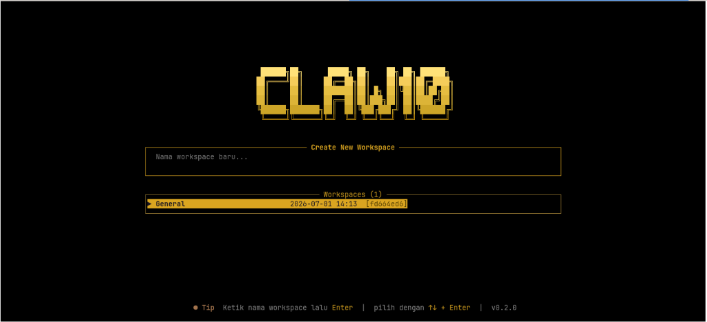
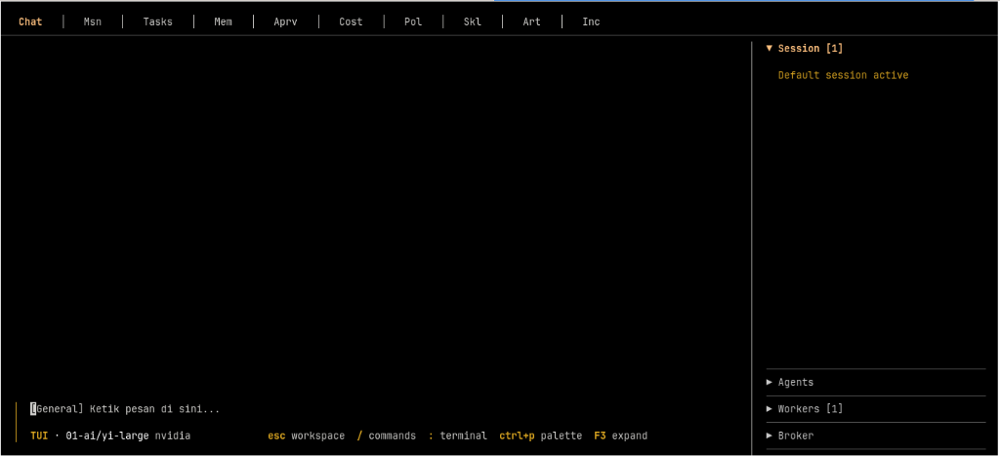

# Claw10 OS

**Recursive, Persistent, and Ephemeral Agent Swarm Operating System**

Claw10 OS adalah sistem operasi untuk kawanan agen AI yang dapat merekrut agen baru secara rekursif, memiliki siklus hidup persisten maupun ephemeral, serta dikontrol melalui API HTTP, TUI (Terminal User Interface), dan CLI.




**Status:** Core runtime, TUI, API, model router, dan control-plane sudah berfungsi. Proyek ini dioptimalkan untuk **single-user, local-first** deployment.

---

## Fitur yang Sudah Berfungsi

| Area | Fitur | Status |
|---|---|---|
| **CLI** | `serve`, `tui`, `run-agent`, `version`, `setup`, `start`, `stop`, `uninstall`, `update`, `check` | ✅ |
| **Installer** | One-line bash/PowerShell installer | ✅ |
| **TUI** | Workspace selector, chat streaming, model selection, command palette, tool approval, 13 management screens | ✅ |
| **HTTP API** | Health, agents, missions, tasks, spawn, lineage, policy, approvals, workers, lifecycle, scheduler, memory, gateway, skills, artifacts | ✅ |
| **Agent Runtime** | Streaming events, tool execution, session management, context window limit, context pipeline | ✅ |
| **Model Router** | Multi-provider OpenAI-compatible (OpenAI, Anthropic, OpenRouter, NVIDIA, Groq, Together, Ollama, dll.), auto-discovery, fallback | ✅ |
| **Tool System** | Shell, ReadFile, WriteFile, Http | ✅ |
| **Store** | InMemory + Sled abstraction, namespaced store | ✅ |
| **Spawn Broker** | Create/approve/deny spawn, depth/budget/swarm validation, child agent creation | ✅ |
| **Event Bus** | InMemory + NATS (feature flag `nats`) | ✅ |
| **Lifecycle Service** | Hibernate, wake, terminate, migrate, lease, heartbeat, stale detection | ✅ |
| **Worker Service** | Register, heartbeat, drain, offline, quarantine, stale detection | ✅ |
| **Scheduler** | Add/list/remove schedules, due schedules | ✅ |
| **Memory Service** | Store/get/update/delete/verify/transition/query + admission pipeline | ✅ |
| **Policy Service** | Evaluate policy bundles, ICVS compiler | ✅ |
| **Skill Service** | Create/list/get/transition/sign skill lifecycle | ✅ |
| **Artifact Service** | Store/get/list/delete artifacts with SHA-256 content hash | ✅ |
| **Gateway** | Webhook, Telegram Bot API, Discord webhook, WhatsApp bridge, Slack, InternalBus | ✅ |
| **Telemetry** | Structured JSON log for Vector observability pipeline | ✅ |

---

## Instalasi

### One-line installer

> `claw10.dev` belum aktif. Gunakan URL GitHub raw di bawah, atau host script `install.sh` / `install.ps1` di domainmu sendiri.

**Linux / macOS / WSL / VPS:**

```bash
curl -fsSL https://raw.githubusercontent.com/crediblemark-official/claw10/master/install.sh | sh
```

**Windows PowerShell:**

```powershell
irm https://raw.githubusercontent.com/crediblemark-official/claw10/master/install.ps1 | iex
```

**Build dari source:**

```bash
git clone https://github.com/crediblemark-official/claw10.git
cd claw10
cargo install --path crates/claw10-cli
```

### Update

**Pengecekan Versi:**
Untuk memeriksa ketersediaan versi terbaru secara manual di CLI tanpa memicu proses unduhan paksa, jalankan:
```bash
claw10 check
```

**Melakukan Pembaruan Bawaan (Native):**
Untuk memperbarui Claw10 OS secara langsung ke versi terbaru dari terminal, jalankan:
```bash
claw10 update
```

Secara alternatif, Anda juga dapat menjalankan skrip shell updater eksternal:
```bash
curl -fsSL https://raw.githubusercontent.com/crediblemark-official/claw10/master/update.sh | sh
```

Updater akan menimpa binary dengan versi terbaru dari GitHub release tanpa menghapus konfigurasi dan data di `~/.claw10`.

### Uninstall

Ketik perintah berikut langsung di terminal Anda untuk menghapus Claw10 OS beserta daemon service, folder database config `~/.claw10`, log harian, folder temporary `/tmp/claw10`, dan membersihkan PATH:

```bash
claw10 uninstall
```

---

## Quickstart

### 1. Setup awal

```bash
claw10 setup
```

Wizard akan membuat file konfigurasi di `~/.claw10/config.toml` (atau `./claw10.toml`) dan meminta API key provider LLM pilihanmu.

### 2. Jalankan server + TUI

```bash
claw10 serve --tui
```

- API server berjalan di `http://0.0.0.0:3000`
- TUI terbuka di terminal yang sama

### 3. Jalankan agent headless

```bash
claw10 run-agent --objective "buat file hello.txt"
```

### 4. Dengan persistent store

```bash
claw10 serve --db /tmp/claw10.sled --tui
```

### 5. Dengan NATS event bus

```bash
NATS_URL=nats://localhost:4222 claw10 serve --features nats -- serve
```

---

## Konfigurasi Provider LLM

File konfigurasi menggunakan format TOML. Contoh `~/.claw10/config.toml`:

```toml
[alias.default]
slot = "openai"
model = "gpt-4o-mini"
api_key = "$OPENAI_API_KEY"

[alias.cheap]
slot = "openai"
model = "gpt-4o-mini"
api_key = "$OPENAI_API_KEY"

[alias.haiku]
slot = "anthropic"
model = "claude-3-5-haiku"
api_key = "$ANTHROPIC_API_KEY"
```

Set API key via environment variable:

```bash
export OPENAI_API_KEY="sk-..."
```

---

## Arsitektur Workspace

Workspace terdiri dari 29 crate:

```
crates/
├── claw10-cli              # Entry point binary
├── claw10-control-api      # HTTP API (axum)
├── claw10-tui              # Terminal UI (ratatui)
├── claw10-agent            # Agent runtime & executor
├── claw10-model-router     # Multi-provider LLM routing
├── claw10-tool             # Tool system
├── claw10-store            # Store abstraction (InMemory + Sled)
├── claw10-domain           # Domain types
├── claw10-spawn            # Spawn broker & validator
├── claw10-lifecycle        # Agent lifecycle
├── claw10-worker           # Worker registry
├── claw10-scheduler        # Schedule service
├── claw10-memory           # Memory service + admission pipeline
├── claw10-policy           # Policy engine
├── claw10-gateway          # Omnichannel gateway
├── claw10-event            # Event bus (InMemory + NATS)
├── claw10-prompt           # Prompt assembly & ICVS
├── claw10-toon             # Context serialization format
├── claw10-icvs             # ICVS policy/prompt compiler
├── claw10-auth             # Agent identity & credential (internal, used by spawn)
├── claw10-mission          # Mission service
├── claw10-task             # Task service
├── claw10-lineage          # Lineage tracking
├── claw10-skill            # Skill lifecycle
├── claw10-artifact         # Artifact storage
├── claw10-context          # Context pipeline
├── claw10-budget           # Budget service
└── claw10-telemetry        # Telemetry events
```

---

## Catatan Hardware / Embedded

Claw10 OS saat ini **tidak memiliki hardware subsystem**. Dukungan untuk board seperti Arduino Uno Q, STM32 Nucleo, Raspberry Pi, Android, Aardvark, dan abstraksi `Peripheral` trait belum diimplementasikan. Menambahkan HAL (Hardware Abstraction Layer) merupakan pekerjaan besar tersendiri yang memerlukan crate baru dan adapter per board.

---

## Build & Test

```bash
# Check
cargo check

# Check dengan NATS
cargo check --features nats

# Test
cargo test -- --test-threads=1

# Build release (LTO + strip)
cargo build --release
```

---

## Lisensi

MIT
